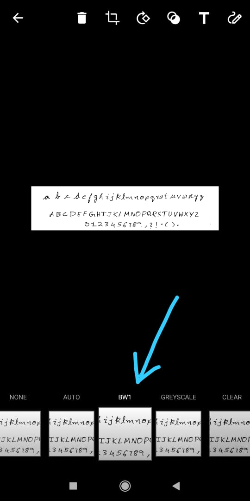
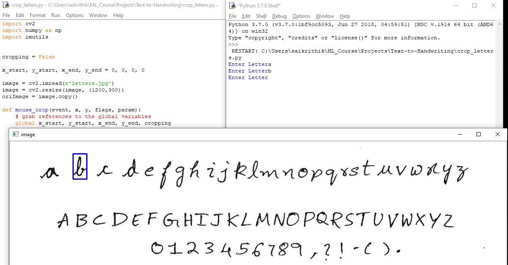
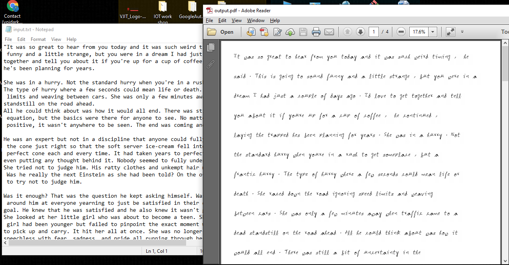

# Text2HandwrittenPDF
Here is my version of project on Text to Handwritten PDF generator. \
**Theme** : Making students and employees to make their own handwritng based text generation.
#### INSTALLATION GUIDE:
Use Anaconda for better experience:
1. create a virtual environment (Recommended)
```cmd
conda create -n environment_name python=3.7
```
2. activate virtual environment
```cmd
conda activate environment_name
```
2. Install requirements.txt
```cmd
pip install -r requirement.txt
```
#### Usage Guide.
##### 1. Capturing Handwritten Letters in Office Lens(B/W filter):


- Store the images in the directory as letters.jpg

##### 2. Run Crop_letters.py to crop ur own letters.


- Crop the size of the letter(Maintain equal height of cropping for each letter) and Enter the letter you are cropping
- In case of Captial letters feed the name as "ua" for "A", "ub" for "B".....
- For characters like  ,.-?!() :
   Feed them as follows
   - "," --> "comma"
   - "." --> "fullstop"
   - "-" --> "hiphen"
   - "?" --> "question"
   - "!" --> "exclamation"
   - "(" --> "braketop"
   - ")" --> "braketcl"
- In case if the frame goes not responding, Just click enter in the shell and it should be fine.

##### 3. Run text2pdf.py
- Store the content you want to be written in input.txt
- Run text2pdf.py from command line or execute it in idle.
- It asks no. of words you want per page.(it depends on ur cropped image pixels so choose the one which suits you :) )
- Your pdf is ready :) , You can also get the images from imageout folder

## Results

### Credits:
This idea is taken from : [reference](https://github.com/sharanya02/Text-file-to-handwritten-pdf-file)
### This project is open for contribution :)
### Features need to be added:
1. Augumenting the cropped image data randomly to make it look real
2. Paragraphs mapping on the text.
